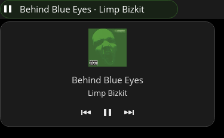

# cosmic-ext-applet-now-playing

A small COSMIC panel applet that shows what is currently playing via MPRIS.

It displays:
- Current track title and artist in the panel
- A popup with album art and media controls
- Album-color inspired panel button styling




## Build

```bash
cargo build --release
```

## Run (Local)

```bash
cargo run
```

## Install (System-Wide)

1. Build release binary.
2. Copy binary to `/usr/bin`.
3. Install desktop entry as a COSMIC applet.

Example:

```bash
cargo build --release
sudo cp target/release/cosmic-ext-applet-now-playing /usr/bin/cosmic-ext-applet-now-playing
sudo cp resources/app.desktop /usr/share/applications/cosmic-ext-applet-now-playing.desktop
```

Then add the applet from COSMIC panel settings.

## Feedback

Feedback is very welcome.

If you report an issue, please include:
- COSMIC version
- Distro and kernel
- Player app used
- Steps to reproduce
- Expected vs actual behavior

## License

This project is licensed under the [GPL-3.0-only license](./LICENSE)
